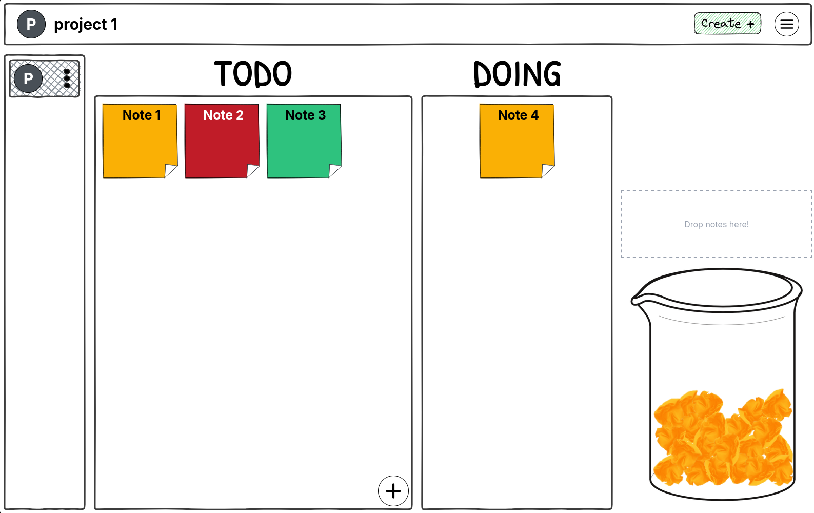
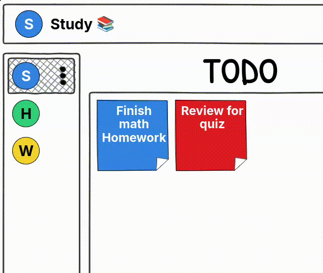

# DoneJar

<div align="center">
  
  
  
  **Turn Completed Tasks Into Satisfaction**
  
  A playful task management app that makes tracking your to-dos enjoyable.
  
  **[✨ Try DoneJar →](https://donejar.pages.dev)**
  
  
</div>

---

## 🎯 What is DoneJar?

DoneJar transforms task management into a visual, satisfying experience. Built on a classic kanban workflow (TODO → DOING → DONE), it adds a unique twist: completed tasks pile up in an animated jar with realistic physics simulation, giving users a tangible sense of accomplishment.

The app features a charming hand-drawn aesthetic with doodle borders and playful typography, making productivity feel less like work and more like play.

**Key differentiators:**

- Physics-based satisfaction jar using Matter.js
- Fully client-side with no accounts or tracking
- Hand-drawn design system for a personal touch
- Multi-project organization with color coding

---

## ✨ Features

### Core Functionality

- 🎯 **Kanban Workflow** - Classic three-column board (TODO, DOING, DONE)
- 🎨 **Colorful Task Cards** - Customizable sticky notes with vibrant colors
- 🫙 **Physics Simulation** - Watch completed tasks accumulate with realistic gravity and collisions
- 📂 **Project Management** - Organize multiple projects with custom names and colors
- 🖱️ **Drag & Drop** - Smooth, intuitive task movement powered by svelte-dnd-action

### User Experience

- 💾 **Auto-Save** - Persistent storage using browser localStorage
- 📱 **Responsive Design** - Optimized for desktop and mobile devices
- 🎨 **Hand-Drawn Aesthetic** - Doodle.css borders and Patrick Hand font
- ⚡ **Instant Feedback** - Real-time updates with no loading states

---

## 🛠️ Tech Stack

### Frontend Framework

- **SvelteKit 2.49** - Full-stack meta-framework with file-based routing and SSR
- **TypeScript 5.9** - Static typing for improved developer experience and code quality
- **Vite 7.2** - Next-generation build tool with HMR

### Styling & UI

- **TailwindCSS 4.1** - Utility-first CSS framework with custom configuration
- **Doodle.css** - Hand-drawn border effects for playful aesthetics
- **Patrick Hand Font** - Google Font for handwritten typography

### State Management & Interactivity

- **Svelte Stores** - Reactive state management
- **svelte-persisted-store** - LocalStorage persistence layer
- **svelte-dnd-action** - Drag-and-drop library with smooth animations
- **Matter.js** - 2D physics engine for the satisfaction jar simulation

### Developer Experience

- **ESLint** - Code linting with Svelte plugin
- **Prettier** - Code formatting with Svelte support
- **Sentry** - Error tracking and performance monitoring
- **TypeScript Strict Mode** - Comprehensive type checking

---

## 🏗️ Architecture

### Project Structure

```
DoneJar/
├── src/
│   ├── lib/
│   │   ├── components/          # Reusable UI components
│   │   │   ├── BeakerPhysics.svelte  # Matter.js physics simulation
│   │   │   ├── StickyNote.svelte     # Task card component
│   │   │   └── board.svelte          # Main kanban board
│   │   ├── stores/              # Svelte stores
│   │   │   └── userData.ts      # Persisted state management
│   │   ├── assets/              # Static assets (images, fonts)
│   │   └── popups/              # Modal components
│   ├── routes/
│   │   ├── +page.svelte         # Landing page
│   │   └── app/                 # Main application
│   │       └── +page.svelte     # Kanban board view
│   └── app.html                 # HTML template
├── static/                      # Public assets
└── tailwind.config.js           # Tailwind configuration
```

### State Management

The app uses a simple, centralized store pattern:

```typescript
interface Project {
  id: string;
  name: string;
  color: string;
  columns: {
    todo: Task[];
    doing: Task[];
    done: Task[];
  };
}

interface AppState {
  activeProjectId: string | null;
  projects: Project[];
}
```

Data is persisted to `localStorage` using `svelte-persisted-store`, providing automatic synchronization between state and storage.

### Physics Implementation

The satisfaction jar uses Matter.js to create realistic particle physics:

- Each completed task becomes a colored "crumpled paper" body
- Physics properties: gravity, friction, restitution
- Boundary walls constrain particles to jar shape
- Canvas rendering with paper texture compositing

---

## 📸 Screenshots

<div align="center">

### DoneJar in Action



</div>

---

## 🚀 Getting Started

### Prerequisites

- Node.js 18+ ([Download](https://nodejs.org/))
- npm, pnpm, or yarn

### Local Development

```bash
# Clone the repository
git clone https://github.com/abdallah-azzouni/DoneJar.git
cd DoneJar

# Install dependencies
npm install

# Start development server
npm run dev
```

The app will be available at `http://localhost:5173`

### Building for Production

```bash
# Create optimized build
npm run build

# Preview production build
npm run preview
```

### Available Scripts

| Command               | Description                                  |
| --------------------- | -------------------------------------------- |
| `npm run dev`         | Start dev server with hot module replacement |
| `npm run build`       | Create production build with optimizations   |
| `npm run preview`     | Serve production build locally               |
| `npm run check`       | Run TypeScript and Svelte type checking      |
| `npm run check:watch` | Type checking in watch mode                  |
| `npm run format`      | Format code with Prettier                    |
| `npm run lint`        | Lint code with ESLint                        |

---

## 🤝 Contributing

Contributions, issues, and feature requests are welcome! This project is open source to foster collaboration and learning.

### How to Contribute

1. **Fork the repository**
2. **Create a feature branch** (`git checkout -b feature/amazing-feature`)
3. **Commit your changes** (`git commit -m 'Add amazing feature'`)
4. **Push to the branch** (`git push origin feature/amazing-feature`)
5. **Open a Pull Request**

### Development Guidelines

- Follow the existing code style (ESLint + Prettier)
- Add TypeScript types for new code
- Test changes across different screen sizes
- Update documentation as needed

### Reporting Issues

Found a bug or have a feature request? [Open an issue](https://github.com/abdallah-azzouni/DoneJar/issues) with:

- Clear description of the problem/feature
- Steps to reproduce (for bugs)
- Expected vs actual behavior
- Screenshots if applicable

See [open issues](https://github.com/abdallah-azzouni/DoneJar/issues) for active discussions and planned work.

---

## 📜 License

This project is licensed under the **Apache License 2.0**. See [LICENSE](LICENSE) for details.

---

## 👤 Author

**Abdallah Azzouni**

- GitHub: [@abdallah-azzouni](https://github.com/abdallah-azzouni)
- Live Project: [donejar.pages.dev](https://donejar.pages.dev)

---

## 🙏 Acknowledgments

- [SvelteKit](https://kit.svelte.dev/) - The amazing full-stack framework
- [Matter.js](https://brm.io/matter-js/) - 2D physics engine
- [Doodle.css](https://chr15m.github.io/DoodleCSS/) - Hand-drawn CSS borders
- [svelte-dnd-action](https://github.com/isaacHagoel/svelte-dnd-action) - Drag-and-drop library
- [Patrick Hand Font](https://fonts.google.com/specimen/Patrick+Hand) - Handwritten typography

---

<div align="center">

**Built with Svelte, TypeScript, and a passion for delightful UX**

[⭐ Star this repo](https://github.com/abdallah-azzouni/DoneJar) if you find it useful!

</div>
