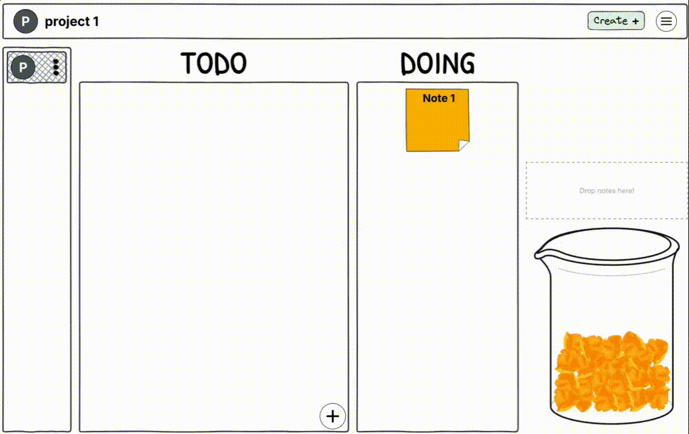
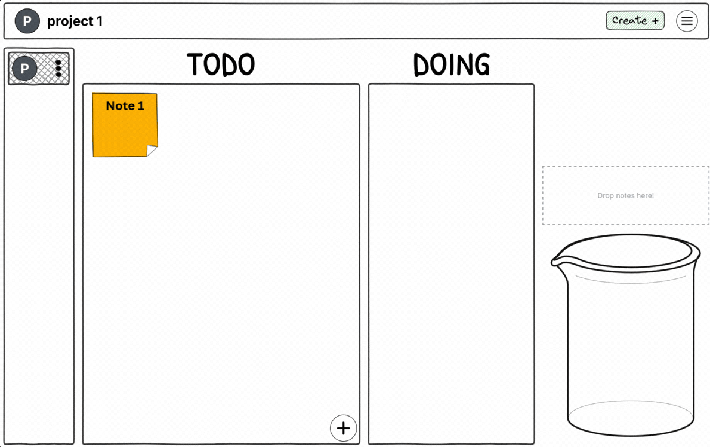

# DoneJar

A kanban-style task manager where completed tasks drop into a physics-simulated jar. Built with SvelteKit and deployed on Cloudflare Pages.

**[Live →](https://donejar.pages.dev)**




---

## Features

- **Kanban board** with drag-and-drop (svelte-dnd-action)
- **Physics jar** — completed tasks fall into a Matter.js-powered beaker
- **Multi-project** — create multiple boards with custom names and colors
- **Flexible columns** — default (TODO/DOING/DONE), blank, or fully custom layouts with optional inbox/jar designation
- **Rich text notes** — Quill editor for task descriptions (headers, lists, links, code, video)
- **Due dates** — optional date and time per task, with overdue indicators
- **CRUD** — create, edit, delete for both projects and notes, with confirmation dialogs
- **Client-side only** — all data in localStorage via svelte-persisted-store
- **Hand-drawn aesthetic** — doodle.css borders, Patrick Hand font




---

## Tech Stack

| Category  | Tools                                                        |
| --------- | ------------------------------------------------------------ |
| Framework | SvelteKit, Svelte 5, TypeScript, Vite                        |
| Styling   | TailwindCSS 4 (Vite plugin), doodle.css, tailwindcss-animate |
| UI        | bits-ui, phosphor-svelte, Quill                              |
| State     | Svelte stores, svelte-persisted-store, runed                 |
| Physics   | Matter.js                                                    |
| DnD       | svelte-dnd-action                                            |
| Dates     | @internationalized/date                                      |
| Deploy    | Cloudflare Pages (adapter-cloudflare)                        |
| Tooling   | ESLint, Prettier                                             |

---

## Project Structure

```
src/
├── lib/
│   ├── Actions.ts                # Data actions (CRUD for projects & notes)
│   ├── UiHelper.ts               # Color contrast, date formatting utils
│   ├── stores/
│   │   ├── userData.ts            # Main app state (persisted)
│   │   └── timer.ts              # Reactive clock store
│   ├── components/
│   │   ├── board.svelte           # Kanban board with columns and jar
│   │   ├── BeakerPhysics.svelte   # Matter.js jar simulation
│   │   ├── StickyNote.svelte      # Task card
│   │   ├── QEditor.svelte         # Quill rich text editor wrapper
│   │   ├── AppHeader.svelte       # Top bar
│   │   ├── ProjectItem.svelte     # Sidebar project entry
│   │   ├── Crumple.svelte         # Crumpled paper visual
│   │   └── Loading.svelte         # Loading screen
│   ├── popups/
│   │   ├── ProjectMenu.svelte     # Create/edit project dialog
│   │   ├── DeletePConfirmation.svelte
│   │   ├── ThemedDialog.svelte    # Reusable dialog wrapper
│   │   └── noteMenu/
│   │       ├── NoteMenu.svelte    # Create/edit note dialog
│   │       ├── DatePicker.svelte  # Date/time picker
│   │       └── DeleteNConfirmation.svelte
│   └── assets/                    # Images, icons, landing page assets
├── routes/
│   ├── +page.svelte               # Landing page
│   ├── +layout.svelte
│   └── app/
│       └── +page.svelte           # Main app view
└── app.html
```

---

## Getting Started

```bash
git clone https://github.com/abdallah-azzouni/DoneJar.git
cd DoneJar
npm install
npm run dev
```

Opens at `http://localhost:5173`.

### Scripts

| Command           | Description                       |
| ----------------- | --------------------------------- |
| `npm run dev`     | Dev server with HMR               |
| `npm run build`   | Production build                  |
| `npm run preview` | Preview production build          |
| `npm run check`   | TypeScript + Svelte type checking |
| `npm run format`  | Format with Prettier              |
| `npm run lint`    | Lint with ESLint                  |

---

## Roadmap

The core task management experience is built and live. What's next, roughly in priority order:

- **Mobile layout** — the app board doesn't work well on small screens yet
- **Column editing** — rename, reorder, add/remove columns on existing projects
- **Data export/import** — JSON backup and restore for localStorage data
- **Jar browsing** — a way to view and retrieve notes from inside the physics jar
- **Accessibility** — keyboard navigation, ARIA roles, focus management
- **Data migration** — schema versioning so localStorage survives future changes
- **Cross-device sync** — optional, longer term

See [open issues](https://github.com/abdallah-azzouni/DoneJar/issues) for what's actively being worked on.

---

## Contributing

See [CONTRIBUTING.md](CONTRIBUTING.md).

---

## License

Apache 2.0 — see [LICENSE](LICENSE).

---

## Author

**Abdallah Azzouni** — [@abdallah-azzouni](https://github.com/abdallah-azzouni)
