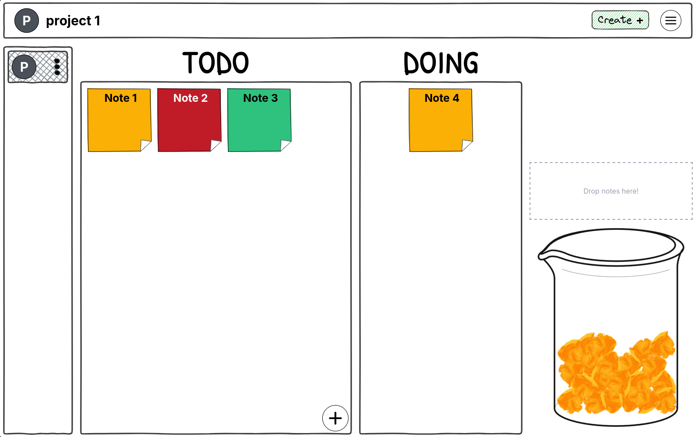
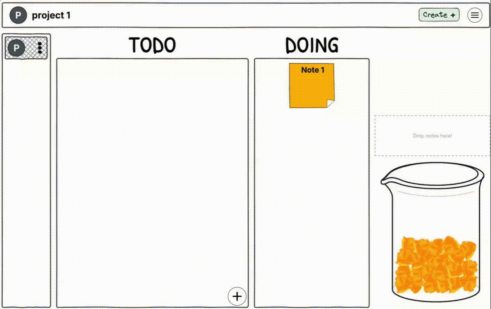

# DoneJar

DoneJar is an offline-first, kanban-style task manager where your completed tasks literally drop into a physics-simulated jar. It solves the mundane feeling of crossing items off a to-do list by making task completion tactile and fun, while still functioning as a robust, capable productivity tool.

**[Live →](https://donejar.pages.dev)**





---

## Key Features

- **Kanban board** with drag-and-drop (svelte-dnd-action)
- **Physics jar** — completed tasks bounce and stack inside a Matter.js-powered beaker
- **Offline-first** — absolutely no load screens; everything saves locally right away
- **Attachments** — drag and drop files directly onto your notes
- **Cross-device sync** — keeps your data updated across devices using PocketBase + R2
- **Rich note styling** — Tags, priority flags, and a visual color picker for all notes
- **Rich text editor** — Quill powers the task descriptions (headers, lists, links, code, video)
- **Multi-project** — create multiple boards with custom names and flexible columns

---

## Tech Stack

- **Framework**: SvelteKit, TypeScript
- **Styling**: TailwindCSS 4.1, doodle.css
- **Local Database**: Dexie (IndexedDB)
- **Physics**: Matter.js
- **Rich Text**: Quill
- **Validation & IDs**: zod, nanoid

---

## Architecture

DoneJar utilizes a **local-first** approach to guarantee incredible speed and offline availability.

- **Storage**: All data relies on an IndexedDB foundation powered by Dexie, with a structured Data Access Layer (DAL) handling queries and mutations.
- **Sync Design**: It seamlessly replicates data back and forth from PocketBase using a `serverVersion` sequence alongside a `synced` flag to track local vs. remote state without overriding newer edits. Attachments are securely shuffled into Cloudflare R2.
- **State**: The application layers UI state management (stores) safely above the DAL infrastructure.

---

## Project Structure

```text
src/
├── lib/
│   ├── actions/          # Domain actions (attachments, notes, projects)
│   ├── components/       # Board, Physics Jar, Sticky notes, etc.
│   ├── db/               # Dexie configuration & Data Access Layer (dal.ts)
│   ├── popups/           # Menus, date pickers, delete confirmations
│   ├── stores/           # App state (current info, UI states, timers)
│   ├── validators/       # zod schemas for core data types
│   └── assets/           # Images, icons, landing page assets
└── routes/               # SvelteKit structure & pages
```

---

## Local Development

```bash
git clone https://github.com/abdallah-azzouni/DoneJar.git
cd DoneJar
npm install
npm run dev
```

The app handles the rest and opens up at `http://localhost:5173`.

### Scripts

| Command | Description |
| --- | --- |
| `npm run build` | Production build |
| `npm run preview` | Preview production build |
| `npm run check` | TypeScript + Svelte type checking |
| `npm run format` | Format with Prettier |
| `npm run lint` | Lint with ESLint |

---

## Roadmap

DoneJar is developed in clear, incremental phases.

### ✅ Phase 1 — Core Experience (Completed)

- Kanban workflow (TODO → DOING → DONE)
- Multi-project support with colors
- Physics-based satisfaction jar
- Drag-and-drop task management
- Responsive, hand-drawn UI
- Deployed production website

### ✅ Phase 2 — Task & Project Management (Completed)

- Edit and delete tasks
- Edit and delete projects
- Task descriptions with rich text
- Task dates and tags
- Improved menus for tasks and projects
- Local Database (Dexie) integration

### 🚧 Phase 3 — Quality of Life & Sync (In Progress)

- **Cross-device sync** — actively building out seamless replication with PocketBase and Cloudflare R2
- **Mobile layout** — improving the kanban board experience on smaller screens
- **Column editing** — rename, reorder, add/remove columns on existing projects
- **Jar browsing** — a way to view and retrieve notes from inside the physics jar
- **Data export/import** — JSON backup and restore for local Dexie database
- **Accessibility** — keyboard navigation, ARIA roles, focus management

See [open issues](https://github.com/abdallah-azzouni/DoneJar/issues) for what's actively being worked on.

---

## Contributing

See [CONTRIBUTING.md](CONTRIBUTING.md).

---

## License

Apache 2.0 — see [LICENSE](LICENSE).

---

## Author

**Abdallah Azzouni** — [@abdallah-azzouni](https://github.com/abdallah-azzouni)
