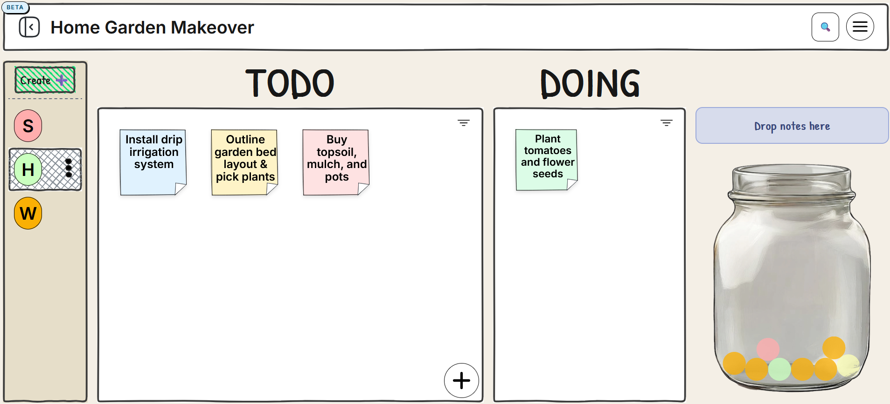
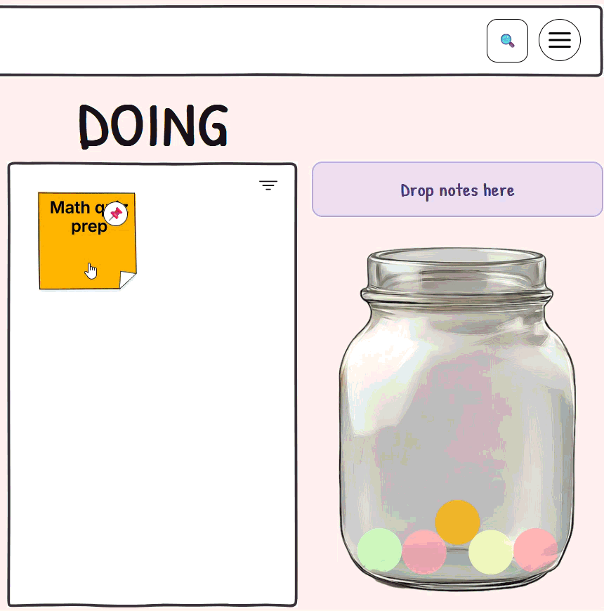

# DoneJar

DoneJar is an offline-first, kanban-style task manager where your completed tasks literally drop into a physics-simulated jar. It solves the mundane feeling of crossing items off a to-do list by making task completion tactile and fun, while still functioning as a robust, capable productivity tool.

**[Live →](https://donejar.app)**





---

## Key Features

- **Kanban Board** — Drag-and-drop task management across customizable columns.
- **Physics Jar** — Completed tasks bounce and stack inside a custom, high-performance canvas-based Verlet integration jar.
- **Column Customization** — Create default, blank, or custom projects with up to 5 custom columns. Set a custom Inbox and Jar column for each board.
- **Sort & Filter** — Individual column sorting (by newest, oldest, due date, priority, or alphabetically) and filtering (by note color or priority flags).
- **Offline-First** — Zero load screens; everything saves locally instantly and syncs in the background when connected.
- **Cross-Device Sync** — Real-time replication across all devices via Supabase.
- **Active Session Management** — View all active devices and locations logged into your account in real-time, with the ability to remotely revoke (kick) any session instantly.
- **Secure Authentication** — Account creation, login, password reset, and secure session management via Supabase Auth.
- **Rich Text Editor** — Quill 2.0 powers task descriptions (headers, lists, links, code blocks, video, and more).
- **Attachments** — Add files (up to 5MB) directly onto notes. (Pro feature).
- **Dates & Priorities** — Rich metadata on every note with due dates and priority levels.
- **Fully Accessible (A11y)** — Built on top of accessible headless primitives (`bits-ui` and `vaul-svelte`), offering full keyboard navigation, focus trap management, and screen-reader friendly ARIA roles.
- **Data Export & Import** — Complete local JSON backup and restore with Ajv schema validation.

---

## Tech Stack

- **Framework**: SvelteKit + Svelte 5 Runes, TypeScript
- **Styling**: TailwindCSS v4, doodle.css, tailwindcss-animate
- **Local Database**: RxDB (Dexie storage adapter) with Ajv validation and key compression
- **Sync**: Supabase (Postgres + Realtime + Auth)
- **Hosting**: Cloudflare Pages
- **Physics**: Custom Canvas-based Verlet Integration Engine (written from scratch, zero external physics dependencies)
- **Rich Text**: Quill 2.0 (with Quill Delta support)
- **Drag and Drop**: Atlassian's Pragmatic Drag and Drop
- **UI Components & A11y**: Bits UI (headless primitives), Vaul Svelte (accessible drawer/bottom sheets), Svelte Sonner (toast notifications), Runed (runes utilities), Phosphor Svelte (icons)
- **Monitoring**: Sentry (Full client-side and server-side error logging, session replays, and performance tracking)
- **Validation & Helpers**: Ajv, NanoID, Bowser (device & user agent detection)

---

## Architecture

DoneJar is built on a **local-first** foundation — the local database is the source of truth, and sync is a background concern.

- **Local Storage**: RxDB with Dexie as the storage adapter, wrapped in `wrappedKeyCompressionStorage` and `wrappedValidateAjvStorage` (in dev). All reads and writes go through a structured Data Access Layer (DAL) that maps RxDB models into clean repository patterns, ensuring separation of concerns.
- **Sync & User Isolation**: Data isolation and synchronization are managed cleanly using RxDB replication modifiers:
  - **Pull modifier**: Sanitizes documents pulled from Supabase by mapping `userId` to `null` before writing locally. This prevents user IDs from being exposed/stored on device and simplifies local multi-user state.
  - **Push modifier**: Dynamically appends the active logged-in user's `userId` when pushing changes, ensuring Supabase Row Level Security (RLS) can validate and authorize the write at the Postgres level.
- **Active Session Tracking**: User sessions are monitored in real-time via a Supabase Postgres replication channel on the `user_sessions` table. Remotely revoking a session deletes the row, triggering database actions that instantly log the target device out via RLS enforcement.
- **State**: UI state sits above the DAL using Svelte 5 reactive state (`$state`, `$derived`). Reactive queries use RxDB observables integrated into Svelte reactivity.

---

## Project Structure

```text
src/
├── lib/
│   ├── actions/          # Domain actions (attachments, notes, projects, backup)
│   ├── components/       # Board, Physics Jar (Verlet), Sticky notes, QEditor, etc.
│   ├── db/               # RxDB setup, schema, repositories (DAL)
│   ├── popups/           # Dialogs, date pickers, side menus, delete confirmations
│   ├── sb/               # Supabase client, auth integration, and replication state
│   ├── stores/           # Svelte 5 state stores (appState, projects, user sessions, subscription)
│   ├── validators/
│   ├── assets/           # Images, icons, landing page assets
│   ├── constants.ts      # App-wide limits, defaults, regex, and routes
│   └── sort.ts           # Sorting comparators for column tasks
└── routes/               # SvelteKit structure & pages (+page, /app, /auth)
```

---

## Local Development

Make sure you have [pnpm](https://pnpm.io/) installed, as DoneJar is configured as a monorepo workspace.

```bash
git clone https://github.com/abdallah-azzouni/DoneJar.git
cd DoneJar
pnpm install
pnpm dev
```

The app opens at `http://localhost:5173`.

### Scripts

| Command        | Description                       |
| -------------- | --------------------------------- |
| `pnpm build`   | Production build                  |
| `pnpm preview` | Preview production build          |
| `pnpm check`   | TypeScript + Svelte type checking |
| `pnpm format`  | Format with Prettier              |
| `pnpm lint`    | Lint with ESLint                  |

---

## Roadmap

### ✅ Phase 1 — Local-first Kanban (Completed)

The full single-player experience. Everything you need to manage tasks on one device.

- Kanban workflow with customizable columns
- Multi-project support with custom names and colors
- Physics-based completion jar (Matter.js)
- Drag-and-drop task management
- Rich text task descriptions (Quill)
- Task dates, and priority flags
- Attachments via Cloudflare R2
- Data export/import (JSON)
- Responsive, hand-drawn UI
- Deployed to production (donejar.app)

### ✅ Phase 2 — Sync & Identity (Completed)

The app gains a persistent identity and works seamlessly across devices.

- Account creation, login, and session management (Supabase Auth)
- Migrated local storage from Dexie to RxDB
- Real-time cross-device sync (RxDB ↔ Supabase replication)
- Per-user scoped local databases
- RLS-enforced access control on all collections
- Offline-first: full functionality without a connection, syncs on reconnect

### 🚧 Phase 3 — Jar & Mobile & Polish (Planned)

The social and platform layer.

- **Pricing** — Free/Pro tier limits
- **Mobile layout** — optimized kanban experience on small screens
- **Mobile & desktop apps** — Tauri packaging for native distribution
- **Jar browsing** — view and retrieve notes from inside the physics jar
- **Column editing** — rename, reorder, add/remove columns
- **Arabic language support**
- **Accessibility** — keyboard navigation, ARIA roles, focus management

---

## Contributing

See [CONTRIBUTING.md](CONTRIBUTING.md).

---

## License

Apache 2.0 — see [LICENSE](LICENSE).

---

## Author

**Abdallah Azzouni** — [@abdallah-azzouni](https://github.com/abdallah-azzouni)
